<!-- ======================= -->
<!--        HEADER           -->
<!-- ======================= -->


<p align="center">
    
</p>

---
```bash
## $ whoami
```
```yaml
Name: Mauro Pérez

Username: MauAle0212

Role: Accounting Student & Automation Developer

Focus:
  - Process Automation
  - Artificial Intelligence
  - Python
  - Power BI
  - SQL

Currently Learning:
  - Python
  - SQL
  - PostgreSQL
  - Power BI
  - n8n
  - Docker

Status: Online

Coffee: ███████████░

Location: Venezuela
```

---
```bash
## about_me.txt
```
```text
I'm passionate about building solutions that automate repetitive work.

My goal is to combine Accounting,
Artificial Intelligence,
Automation,
and Business Intelligence
to build tools that save businesses time.

Current Mission:

✓ Learn every day.

✓ Build useful projects.

✓ Solve real business problems.

✓ Launch my own SaaS.
```

---

```bash
$ tech_stack/
```

<div align="center">


<br><br>


</div>

---

```bash
$ pwd
```

```bash
/github/MauAle0212
│
├── 🤖 Automation
├── 🧠 Artificial-Intelligence
├── 🐍 Python
├── 📊 PowerBI
├── 🗄 SQL
├── 🐳 Docker
└── 🐧 Linux
```

---
```bash
$ htop
```

```text
Automation     ████████████████████ 

Python         ████████████░░░░░░░░ 

SQL            ██████████░░░░░░░░░░ 

Power BI       ███████░░░░░░░░░░░░░

Docker         ██████████░░░░░░░░░░

Linux          ███████████░░░░░░░░░

Coffee         ████████████████████
```

---

```bash
$ github_activity
```

<div align="center">


<br>


</div>

---

```bash
# > social_links
```

<div align="center">

<a href="">

</a>

<a href="https://www.linkedin.com/in/mauro-p%C3%A9rez-767954302/">

</a>

<a href="mailto:mauroperez.analytics@gmail.com">

</a>

<a href="">

</a>

</div>

---

```bash
# > exit
```

```text
Connection closed.

Thanks for visiting my profile 👋

See you in the next commit.
```
